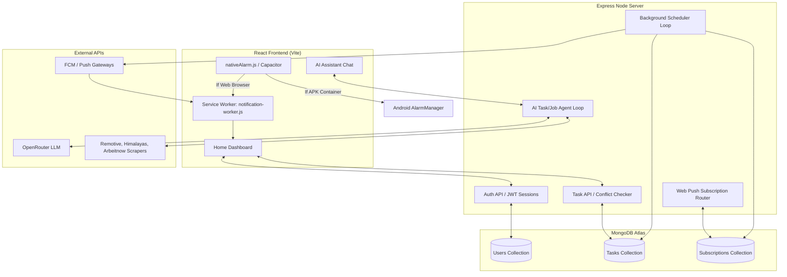

# Momentum Agent: Technical Underwriting & Reference Guide

Momentum Agent is a full-stack, AI-orchestrated task planner and conversational assistant designed to help users schedule their day, practice coding/interviews, and search for active career opportunities.

This project is organized as a monorepo containing a **Node.js Express backend server** and a **Vite React frontend client**.

---

## 🗺️ System Architecture & Data Flows

The Momentum system consists of three main components:
1. **Vite React Client**: The user interface, task dashboard, chat page, native Capacitor Android bridge, and service worker registration.
2. **Express Backend Server**: Auth routes, task CRUD operations with boundary checks, search orchestrators, Web Push subscription endpoints, and a background poller.
3. **MongoDB Database**: Collections for User profiles, Task schedules, and Web Push subscriptions.

### High-Level Architecture Diagram



### Key Workflows

```
1. Client Auth   ➜ User registers/logs in ➜ Auth cookie stored ➜ Web Push worker registers
2. Task Creation ➜ Input task time ➜ Mongoose conflict check ➜ Saved in MongoDB if slot free
3. Web Push Loop ➜ Scheduler runs every 30s ➜ Checks upcoming tasks ➜ FCM triggers Web Push Worker
4. Native Alarm  ➜ Runs inside WebView ➜ Detects window.Capacitor ➜ Bypasses Web Push ➜ Schedules Android AlarmManager
```

---

## 🚀 Core Features & Implementation Logic

### 1. AI Task Assistant
- **Files**: [agent.js](file:///c:/Users/ashis/Downloads/Agent/LLM/agent.js) & [chatRoutes.js](file:///c:/Users/ashis/Downloads/Agent/service/chatRoutes.js)
- **Logic**: A memory-retained conversational agent powered by OpenRouter LLMs. It features parallelized custom tool calls that scrape job boards (Himalayas, Remotive, Arbeitnow) and run DuckDuckGo search parsing for instant web indexing.

### 2. Background Web Push Reminders
- **Files**: [service.js](file:///c:/Users/ashis/Downloads/Agent/notification/service.js) & [notification-worker.js](file:///c:/Users/ashis/Downloads/Agent/client/public/notification-worker.js)
- **Logic**: Registers a custom background service worker ([notification-worker.js](file:///c:/Users/ashis/Downloads/Agent/client/public/notification-worker.js)) to receive notifications. The backend runs a poller loop every 30 seconds to fetch scheduled tasks that are starting. It pushes payload objects containing vibration configurations, descriptions, and custom action options (`Open Chat 💬` and `Dismiss ❌`) with a Momentum blue theme (`#0252e3`).

### 3. Android APK Native Alarm Bridge
- **File**: [nativeAlarm.js](file:///c:/Users/ashis/Downloads/Agent/client/src/alarm/nativeAlarm.js)
- **Logic**: Integrates directly with native system clocks. When running within a mobile application wrapper (such as Capacitor.js), browser sandbox limits are bypassed. The module maps the scheduled task trigger directly to the Android `AlarmManager` native API for reliable, offline wake-ups. When running in standard browser sandboxes, it gracefully falls back to the server-sent Web Push reminders.

### 4. Schedule Conflict Prevention
- **File**: [service.js](file:///c:/Users/ashis/Downloads/Agent/task/service.js)
- **Logic**: Validates time slot availability on task creation or update. The controller evaluates boundary intersections using a strict date interval formula:
  $$\text{Overlap} \iff (\text{start}_A < \text{end}_B) \land (\text{start}_B < \text{end}_A)$$
  If a conflict occurs, the API throws an HTTP 400 Bad Request error preventing duplicate entries.

### 5. Dynamic Dashboard Updates
- **File**: [homeContext.jsx](file:///c:/Users/ashis/Downloads/Agent/client/src/pages/home/homeContext.jsx)
- **Logic**: Home context handles dynamic real-time clock syncing and schedules a 10-second ticker loop. As soon as a task's end-time is reached, the application automatically triggers local state filtering to slide tasks out of the active view without demanding full page refreshes.

---

## 🛠️ Project Structure Reference

The codebase is organized as follows:

- [index.js](file:///c:/Users/ashis/Downloads/Agent/index.js): Express backend entrypoint (serves APIs, registers cookie/cors middleware, launches poller).
- [db.js](file:///c:/Users/ashis/Downloads/Agent/db.js): Mongoose database connection initialization.
- [package.json](file:///c:/Users/ashis/Downloads/Agent/package.json): Root backend dependencies and description.
- [client/](file:///c:/Users/ashis/Downloads/Agent/client/): React application root.
  - [client/vite.config.js](file:///c:/Users/ashis/Downloads/Agent/client/vite.config.js): Local development proxy options `/user` and `/service` mapping to port 80.
  - [client/public/notification-worker.js](file:///c:/Users/ashis/Downloads/Agent/client/public/notification-worker.js): Background push service worker.
  - [client/src/config.js](file:///c:/Users/ashis/Downloads/Agent/client/src/config.js): Centralized base URL helper and credentials configuration.
  - [client/src/alarm/nativeAlarm.js](file:///c:/Users/ashis/Downloads/Agent/client/src/alarm/nativeAlarm.js): Mobile APK bridge and fallback router.
- [task/](file:///c:/Users/ashis/Downloads/Agent/task/): MongoDB task schemas, routers, and boundary validation handlers.
- [user/](file:///c:/Users/ashis/Downloads/Agent/user/): JWT user session middleware, auth handlers, and password validators.
- [notification/](file:///c:/Users/ashis/Downloads/Agent/notification/): Push subscriptions database models, VAPID key generator, and background poller daemon.
- [LLM/](file:///c:/Users/ashis/Downloads/Agent/LLM/): LLM orchestrator core and prompt formatting utilities.
- [jobSearch/](file:///c:/Users/ashis/Downloads/Agent/jobSearch/): Parallel search scrappers and keyword expansion pipeline.
- [webSearch/](file:///c:/Users/ashis/Downloads/Agent/webSearch/): DuckDuckGo HTML parser for internet searches.

---

## ⚙️ Environment Variables Configuration

Configure a local `.env` (backend) and repository secrets (frontend) to initialize all subsystems:

### Backend Configuration (Local `.env` or Server Environment)

Create a `.env` in the root folder of the project:

```bash
# Server Port (default is 80)
PORT=80

# Database Connection
MONGODB_URI=mongodb+srv://<username>:<password>@cluster.mongodb.net/momentum

# JWT Auth Secret
JWT_SECRET=super_secure_jwt_token_sign_key_987654321

# CORS Allowed Client Origins (Comma-separated)
# Replace with your actual GitHub Pages URL when deploying to production
CORS_ORIGINS=http://localhost:5173,https://your-github-username.github.io

# AI Orchestrator Integration
OPENROUTER_API_KEY=sk-or-v1-xxxxxxxxxxxxxxxxxxxxxxx
AI_MODEL=google/gemma-3-27b-it:free
APP_URL=http://localhost:5173

# Web Push Keys
# If left empty, the server automatically generates keys on boot and prints them to console
VAPID_PUBLIC_KEY=BH-xxxxxxxxxxxxxxxxxxxxxxxxxxxxxxxxxxxxxxxx
VAPID_PRIVATE_KEY=xxxxxxxxxxxxxxxxxxxxxxxxxxxxxxxxxxxxxxxxx

# Upstash Redis Rate Limiting (Optional)
UPSTASH_REDIS_REST_URL=https://xxxxxxxx.upstash.io
UPSTASH_REDIS_REST_TOKEN=xxxxxxxxxxxxxxxxxxxxxxxxxx
RATE_LIMIT_PER_MINUTE=60
RATE_LIMIT_PER_DAY=1000
```

### Frontend Configuration (Vite App)

In local development, Vite uses the proxy rule inside `vite.config.js` to route backend requests locally. For custom environments or hosting domains, configure the following:

- **Variable**: `VITE_API_BASE_URL`
- **Description**: Target server URL (e.g., `https://your-backend.vercel.app`).
- **Local Dev**: Leave empty so queries hit the built-in localhost proxy.
- **Production CI/CD**: Save as a secret variable inside your GitHub Repository settings to let the deploy action inject it during build.

---

## 🚀 Setup & Execution Instructions

### Local Development

1. **Database Setup**: Ensure a local MongoDB instance is running, or get an Atlas MongoDB URI.
2. **Backend Server Setup**:
   ```bash
   # In the root folder
   npm install
   npm run dev  # (If nodemon is set up) or node index.js
   ```
3. **Frontend Client Setup**:
   ```bash
   # Navigate to client directory
   cd client
   npm install
   npm run dev
   ```
   Open `http://localhost:5173` in your browser.

---

## 📦 Cloud Deployment Guide

To host this project in a distributed manner (Backend on Vercel and Frontend on GitHub Pages):

### 1. Hosting Backend on Vercel
Vercel is designed for serverless environments. To prepare the Express backend:
1. Ensure `index.js` exports the app or is structured correctly for serverless invocation.
2. Setup a `vercel.json` config at root mapping endpoints:
   ```json
   {
     "version": 2,
     "builds": [
       { "src": "index.js", "use": "@vercel/node" }
     ],
     "routes": [
       { "src": "/(.*)", "dest": "index.js" }
     ]
   }
   ```
3. Register backend environmental keys in the Vercel Dashboard (e.g. `MONGODB_URI`, `JWT_SECRET`, `CORS_ORIGINS`, `VAPID_PUBLIC_KEY`, `VAPID_PRIVATE_KEY`).
4. **CRITICAL CORS & COOKIES NOTE**: Because the client lives on GitHub Pages and the server lives on Vercel, cookies must travel cross-origin.
   - Configure session cookies in `user/auth.js` with:
     ```javascript
     res.cookie("token", token, {
       httpOnly: true,
       secure: true,      // Must be true on HTTPS (Vercel)
       sameSite: "none"   // Allows cross-site cookie transmission
     });
     ```
   - Ensure `CORS_ORIGINS` includes your absolute GitHub Pages domain (without trailing slash).

### 2. Hosting Frontend on GitHub Pages (CI/CD Automated)
We have prepared a Github Actions workflow: [.github/workflows/deploy-client.yml](file:///c:/Users/ashis/Downloads/Agent/.github/workflows/deploy-client.yml).
1. Go to your GitHub repository **Settings ➜ Secrets and Variables ➜ Actions**.
2. Add a Repository Secret:
   - **Name**: `VITE_API_BASE_URL`
   - **Value**: The Vercel deployment URL (e.g., `https://your-api.vercel.app`).
3. Commit and push your modifications to the `main` branch.
4. The workflow will automatically compile the React source, inject the API Base URL, and deploy the assets to the `gh-pages` branch.
5. In GitHub, go to **Settings ➜ Pages** and verify that the source is set to build from the `gh-pages` branch.

---

## 📱 Compiling into an Android APK (Capacitor WebView)

To package the frontend React client into a native mobile application (`.apk` format) that accesses device hardware via web view bindings:

### 1. Prepare Capacitor inside Client
Navigate to the client directory and add Capacitor dependencies:
```bash
cd client
npm install @capacitor/core @capacitor/cli
```

### 2. Initialize Configuration
Initialize Capacitor configurations (be sure to compile Vite production build to `/dist` first):
```bash
# Build the production bundle
npm run build

# Initialize Capacitor project
npx cap init "Momentum Agent" "com.momentum.agent" --web-dir=dist
```

### 3. Add Android SDK Platform
Install the Android plugin wrapper and add the platform folder:
```bash
npm install @capacitor/android
npx cap add android
```

### 4. Synchronize Client Assets
Whenever you make updates in React src files, you must build the client and synchronize the compiled code into the Android container project:
```bash
npm run build
npx cap sync
```

### 5. Writing the Android Java AlarmManager Plugin
To utilize `nativeAlarm.js`, you must define the native implementation in Java. In your generated `android/` project folder, create a Java Plugin file `AlarmManagerPlugin.java`:

```java
package com.momentum.agent;

import android.app.AlarmManager;
import android.app.PendingIntent;
import android.content.Context;
import android.content.Intent;
import com.getcapacitor.JSObject;
import com.getcapacitor.Plugin;
import com.getcapacitor.PluginCall;
import com.getcapacitor.PluginMethod;
import com.getcapacitor.annotation.CapacitorPlugin;

@CapacitorPlugin(name = "AlarmManager")
public class AlarmManagerPlugin extends Plugin {

    @PluginMethod
    public void setAlarm(PluginCall call) {
        Long time = call.getLong("time");
        String message = call.getString("message");

        if (time == null) {
            call.reject("Time parameter is required");
            return;
        }

        Context context = getContext();
        AlarmManager alarmManager = (AlarmManager) context.getSystemService(Context.ALARM_SERVICE);
        Intent intent = new Intent(context, AlarmReceiver.class);
        intent.putExtra("message", message);

        PendingIntent pendingIntent = PendingIntent.getBroadcast(
            context, 
            (int) System.currentTimeMillis(), 
            intent, 
            PendingIntent.FLAG_UPDATE_CURRENT | PendingIntent.FLAG_IMMUTABLE
        );

        if (alarmManager != null) {
            alarmManager.setExactAndAllowWhileIdle(AlarmManager.RTC_WAKEUP, time, pendingIntent);
            JSObject ret = new JSObject();
            ret.put("success", true);
            call.resolve(ret);
        } else {
            call.reject("AlarmManager system service not available");
        }
    }
}
```

Make sure to register this plugin inside `MainActivity.java`:
```java
package com.momentum.agent;

import android.os.Bundle;
import com.getcapacitor.BridgeActivity;

public class MainActivity extends BridgeActivity {
    @Override
    public void onCreate(Bundle savedInstanceState) {
        registerPlugin(AlarmManagerPlugin.class);
        super.onCreate(savedInstanceState);
    }
}
```

### 6. Compile Android APK in Android Studio
1. Open the project inside Android Studio:
   ```bash
   npx cap open android
   ```
2. Wait for Gradle sync to finish.
3. Build the APK inside Android Studio:
   - Go to: **Build ➜ Build Bundle(s) / APK(s) ➜ Build APK(s)**.
4. Locate the compiled file `app-debug.apk` inside your local directory structure:
   `android/app/build/outputs/apk/debug/app-debug.apk`
5. Sideload and install the package on your Android device!

---

## 🔍 Troubleshooting & Implementation Gotchas

- **Vite Proxy traps Service Worker requests**: By default, naming the service worker `/service-worker.js` conflicts with backend Express proxies routing `/service/*`. Ensure the worker is named [notification-worker.js](file:///c:/Users/ashis/Downloads/Agent/client/public/notification-worker.js) (registered explicitly under `/notification-worker.js` in client provider code).
- **Vercel Ephemeral Storage & VAPID keys**: Vercel functions cannot persist generated files on disk. The backend scheduler priority reads the keys from database models or environment settings (`VAPID_PUBLIC_KEY`, `VAPID_PRIVATE_KEY`) rather than writing local configurations onto server storage.
- **Cross-site Cookie Block**: In production, if you receive auth validation issues, verify that your client fetch utilizes `credentials: "include"` and your Express response token cookie contains `secure: true` and `sameSite: "none"`. Standard `Lax` or `Strict` cookies are dropped by browsers when accessing APIs across different primary domains.
